# 에너지엑스 인사 평가 — 구성원 사용자 매뉴얼

이 문서는 **구성원** 권한으로 접속했을 때의 화면을 기준으로 작성되었습니다. KPI를 작성하고, 중간 점검과 본인평가를 제출하고, 확정된 결과를 확인하는 흐름을 다룹니다.

> 화면 캡처의 이름·이메일·금액은 실제 값이 아닌 예시 데이터입니다.

## 목차

- [대시보드](#대시보드) — 대시보드
- [KPI 작성](#kpi-작성) — 인사평가 > KPI 작성
- [본인평가](#본인평가) — 인사평가 > 본인평가
- [중간 점검 — 내 중간 점검](#중간-점검--내-중간-점검) — 인사평가 > 중간 점검
- [역량평가](#역량평가) — 인사평가 > 역량평가
- [내 평가표](#내-평가표) — 인사평가 > 내 평가표
- [중간 점검 — 목표 재조정 신청](#중간-점검--목표-재조정-신청) — 인사평가 > 중간 점검 > 목표 재조정
- [평가결과 상세](#평가결과-상세) — 인사평가 > 평가결과 > 상세
- [알림함 — 안읽음](#알림함--안읽음) — 헤더 > 알림 > 전체 보기 > 안읽음
- [이의제기](#이의제기) — 모니터링 > 이의제기
- [알림함](#알림함) — 헤더 > 알림 > 전체 보기
- [설정 — 알림](#설정--알림) — 기타 > 설정
- [설정 — 비밀번호 변경](#설정--비밀번호-변경) — 기타 > 설정 > 비밀번호 변경
- [조직도](#조직도) — 직접 이동 (/org)

---

## 대시보드

**메뉴 경로** · 대시보드  
**주소** · `/dashboard`

로그인 후 처음 만나는 화면입니다. 지금 처리해야 할 일, 평가 진행 상황, 최근 알림을 한눈에 확인합니다.

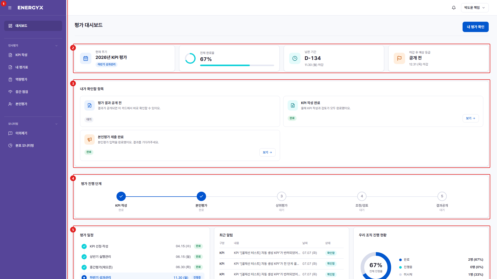

| 번호 | 설명 |
| :---: | --- |
| 1 | **전체 메뉴** : 인사평가·모니터링 등으로 묶인 메뉴입니다. 좌측 상단 아이콘으로 접을 수 있습니다. |
| 2 | **요약 타일** : 현재 평가 주기, 전체 완료율, 마감까지 남은 기간, 결과 공개 예정일입니다. |
| 3 | **내가 확인할 항목** : 지금 처리해야 할 일이 카드로 표시됩니다. 버튼을 누르면 해당 화면으로 바로 이동합니다. |
| 4 | **평가 진행 단계** : KPI 작성 → 본인평가 → 상위평가 → 조정/검토 → 결과공개 중 현재 위치입니다. |
| 5 | **평가 일정 · 최근 알림 · 조직 진행 현황** : 단계별 마감일과 최근 알림, 소속 조직의 진행률입니다. |

---

## KPI 작성

**메뉴 경로** · 인사평가 > KPI 작성  
**주소** · `/kpi`

연초에 본인의 KPI(성과 목표)를 작성해 상급자에게 제출합니다. 가중치 합계가 100%가 되어야 제출할 수 있습니다.

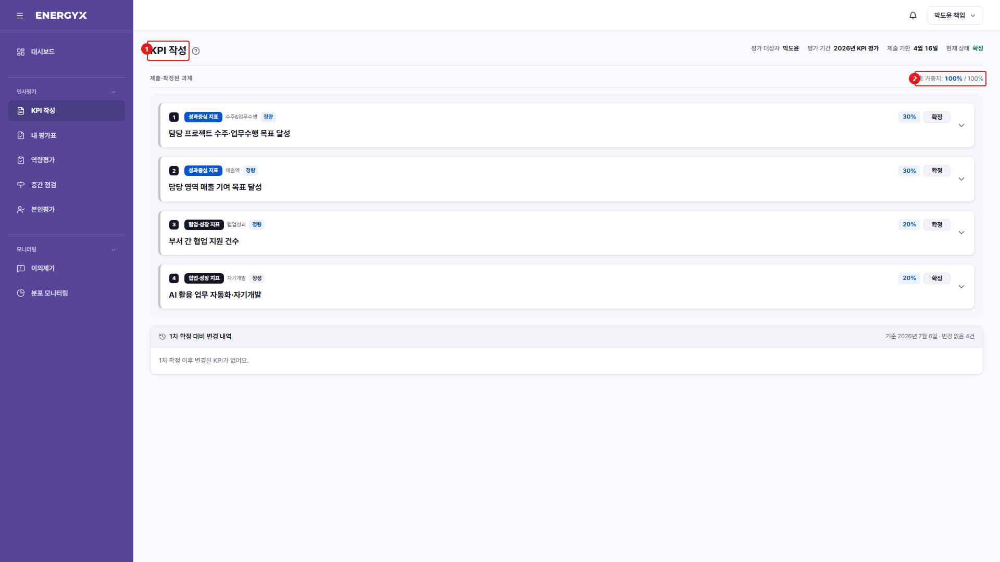

| 번호 | 설명 |
| :---: | --- |
| 1 | **KPI 작성** : 올해 본인의 성과 목표를 등록하는 화면입니다. |
| 2 | **가중치** : 과제별 비중입니다. 전체 합계가 100%가 되어야 제출할 수 있습니다. |

---

## 본인평가

**메뉴 경로** · 인사평가 > 본인평가  
**주소** · `/eval/self`

확정된 KPI에 대해 본인의 실적과 등급을 입력해 제출합니다. 평가 기간(최종평가 일정) 안에서만 작성할 수 있습니다.

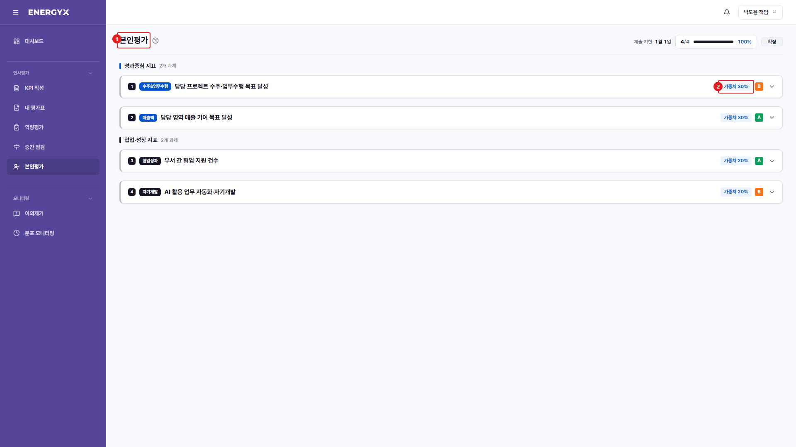

| 번호 | 설명 |
| :---: | --- |
| 1 | **본인평가** : 확정된 KPI에 대해 실적과 등급을 입력합니다. |
| 2 | **과제별 카드** : 확정된 KPI가 순서대로 표시되고, 각 카드에서 실적과 등급(S~D)을 선택합니다. |

---

## 중간 점검 — 내 중간 점검

**메뉴 경로** · 인사평가 > 중간 점검  
**주소** · `/eval/midterm`

연중 목표 진척을 스스로 점검해 제출합니다. 등급·보상에는 반영되지 않는 참고 절차입니다.

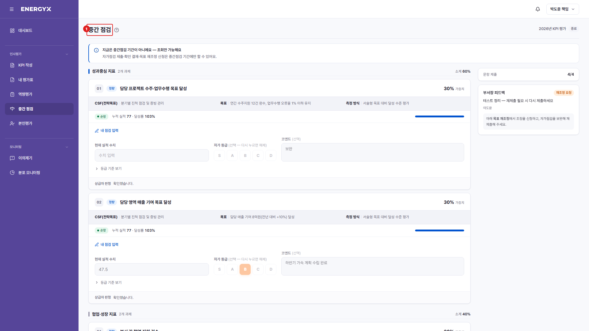

| 번호 | 설명 |
| :---: | --- |
| 1 | **중간 점검** : 연중 목표 진척을 스스로 점검해 제출하는 화면입니다. |
| 2 | **총평** : 상반기 진행 상황을 서술로 남깁니다. [총평 저장]으로 임시 저장됩니다. |

---

## 역량평가

**메뉴 경로** · 인사평가 > 역량평가  
**주소** · `/competency/eval`

본인의 역량을 5점 척도로 평가합니다. 엑셀 역량평가서와 같은 표 형식이며, 평가자 열은 평가가 끝난 뒤에 공개됩니다. 역량평가 결과는 참고용으로, 연봉·최종등급에는 반영되지 않습니다. 조정/검토 단계부터 열립니다.

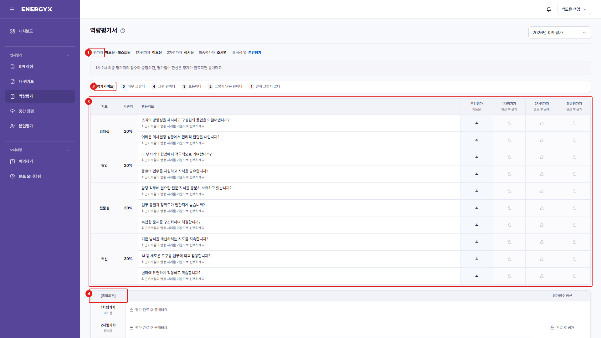

| 번호 | 설명 |
| :---: | --- |
| 1 | **평가선** : 나를 평가하는 1차·2차·최종 평가자와, 내가 입력하는 열을 표시합니다. |
| 2 | **평가가이드** : 5점(매우 그렇다) ~ 1점(전혀 그렇지 않다) 척도 기준입니다. |
| 3 | **평가표** : 지표·가중치·행동지표와 점수 열입니다. [본인평가] 열만 입력할 수 있고, 평가자 열은 자물쇠로 가려집니다. |
| 4 | **종합의견 · 평가점수 환산** : 평가자가 남긴 의견과 환산 점수로, 평가가 완료된 뒤 공개됩니다. |

---

## 내 평가표

**메뉴 경로** · 인사평가 > 내 평가표  
**주소** · `/eval/my`

본인의 평가 진행 상황과 확정된 평가 결과를 확인합니다. 결과는 조정/검토가 끝나 주기가 마감된 뒤 공개됩니다.

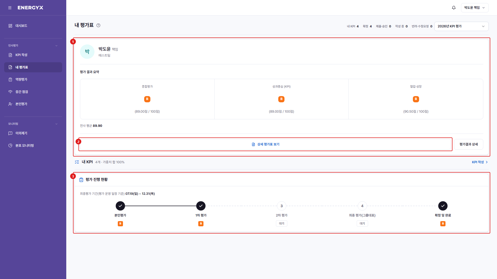

| 번호 | 설명 |
| :---: | --- |
| 1 | **평가 결과 요약** : 종합평가 등급·점수와 영역별 등급, 전사 평균입니다. |
| 2 | **상세 보기** : 과제별 점수와 평가자 코멘트가 담긴 상세 평가표로 이동합니다. |
| 3 | **평가 진행 현황** : 본인평가 → 1차 → 2차 → 최종 → 확정 단계의 진행 상태와 단계별 등급입니다. |

---

## 중간 점검 — 목표 재조정 신청

**메뉴 경로** · 인사평가 > 중간 점검 > 목표 재조정  
**주소** · `/eval/midterm`

사업 환경이 바뀌어 처음 세운 목표가 맞지 않으면 재조정을 신청합니다. 현재 목표·가중치와 바꾸려는 값을 함께 적어 보내면 상급자가 검토해 승인하거나 반려합니다.

| 번호 | 설명 |
| :---: | --- |
| 1 | **재조정 신청** : 변경할 목표·가중치와 사유를 적습니다. 승인되면 이후 평가는 새 목표를 기준으로 진행됩니다. |

---

## 평가결과 상세

**메뉴 경로** · 인사평가 > 평가결과 > 상세  
**주소** · `/eval/result`

과제별 점수와 평가자 코멘트가 담긴 상세 평가표입니다. 구성원은 [평가결과] 메뉴를 누르면 본인 상세로 바로 이동하고, 팀장은 목록에서 대상을 골라 들어갑니다.

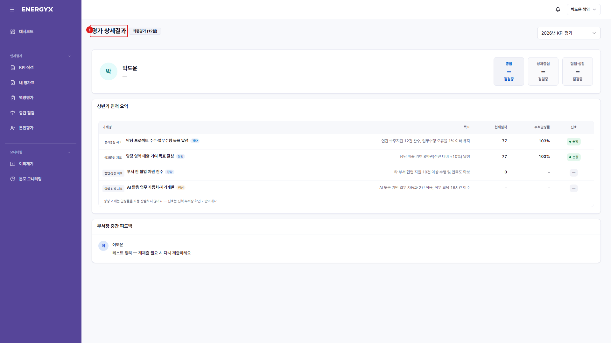

| 번호 | 설명 |
| :---: | --- |
| 1 | **평가결과 상세** : 대상자와 평가 주기를 표시합니다. |

---

## 알림함 — 안읽음

**메뉴 경로** · 헤더 > 알림 > 전체 보기 > 안읽음  
**주소** · `/notifications`

아직 확인하지 않은 알림만 모아 봅니다. 마감이 임박한 항목을 놓치지 않는 데 씁니다.

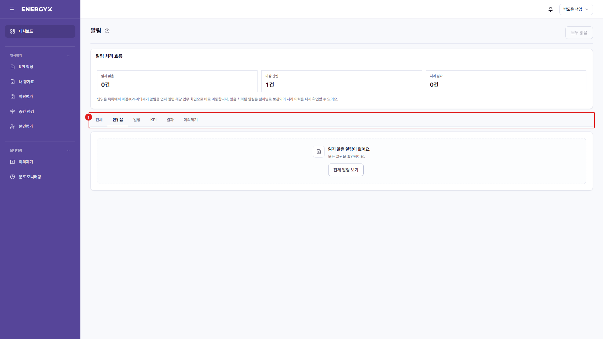

| 번호 | 설명 |
| :---: | --- |
| 1 | **안읽음 탭** : 미확인 알림만 걸러 보여줍니다. 숫자는 남은 건수입니다. |

---

## 이의제기

**메뉴 경로** · 모니터링 > 이의제기  
**주소** · `/appeals`

확정된 평가 결과에 이의가 있으면 신청하고 처리 경과를 확인합니다.

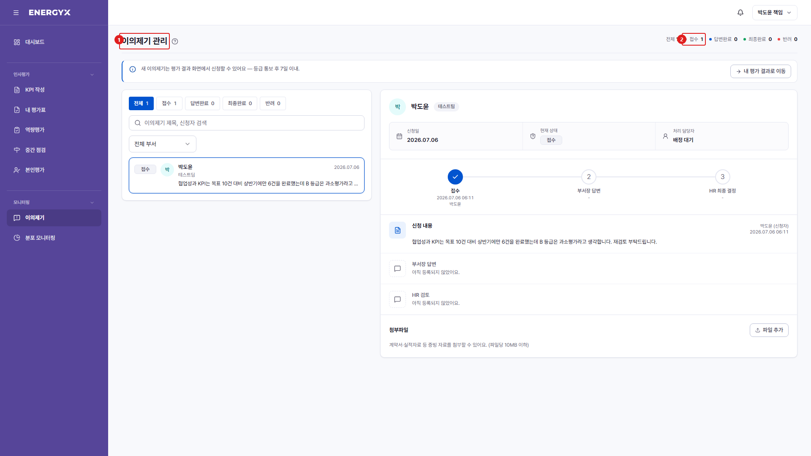

| 번호 | 설명 |
| :---: | --- |
| 1 | **이의제기** : 확정된 결과에 대한 이의를 신청하고 진행 상태를 확인합니다. |
| 2 | **상태** : 접수 → 답변완료 → 최종완료 순으로 진행됩니다. |

---

## 알림함

**메뉴 경로** · 헤더 > 알림 > 전체 보기  
**주소** · `/notifications`

받은 알림을 유형별로 모아 봅니다. 헤더의 알림 아이콘에서 [전체 보기]로 이동합니다.

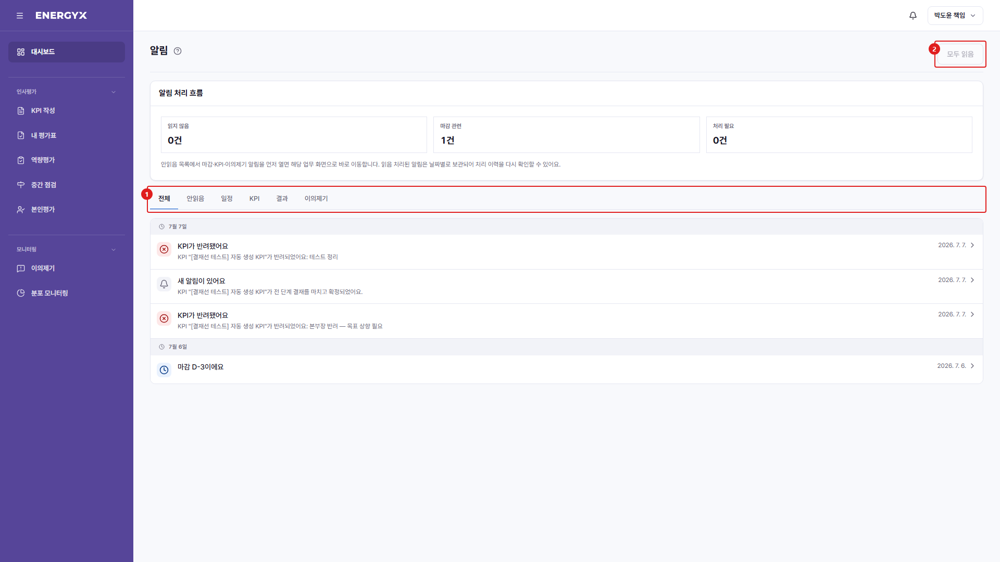

| 번호 | 설명 |
| :---: | --- |
| 1 | **유형 탭** : 전체·안읽음·일정·KPI·결과·이의제기로 알림을 분류합니다. |
| 2 | **모두 읽음** : 안읽은 알림을 한 번에 읽음 처리합니다. |

---

## 설정 — 알림

**메뉴 경로** · 기타 > 설정  
**주소** · `/admin/settings`

받을 알림 종류를 켜고 끕니다.

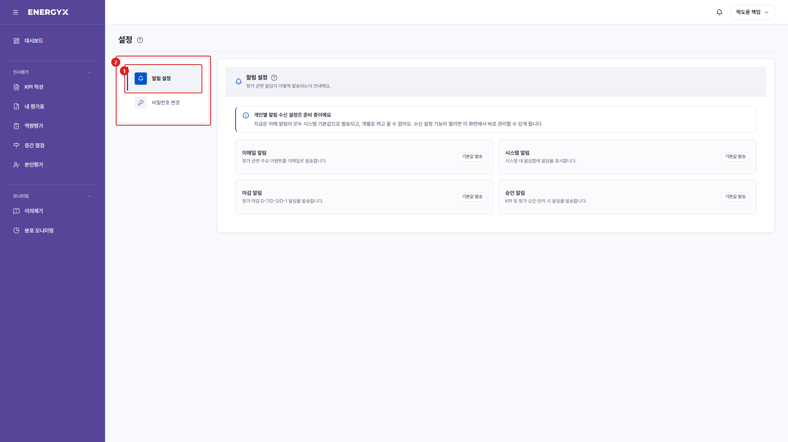

| 번호 | 설명 |
| :---: | --- |
| 1 | **탭 전환** : 알림 설정과 비밀번호 변경으로 나뉩니다. |
| 2 | **알림 설정** : 받을 알림 종류를 선택합니다. |

---

## 설정 — 비밀번호 변경

**메뉴 경로** · 기타 > 설정 > 비밀번호 변경  
**주소** · `/admin/settings`

로그인 비밀번호를 변경합니다.

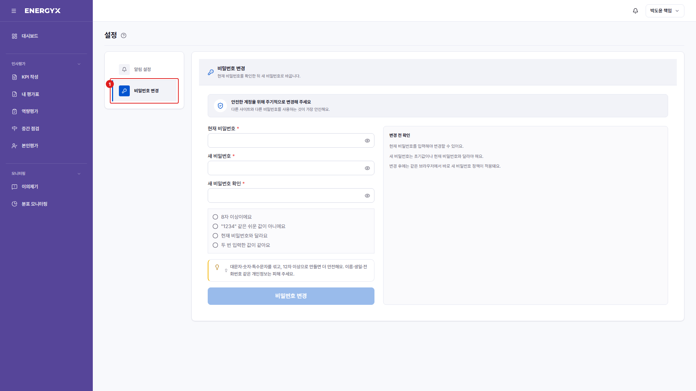

| 번호 | 설명 |
| :---: | --- |
| 1 | **탭 전환** : [비밀번호 변경] 탭을 선택합니다. |

---

## 조직도

**메뉴 경로** · 직접 이동 (/org)  
**주소** · `/org`

그룹 → 본부 → 팀 → 개인의 4단계 조직 구조를 확인합니다.

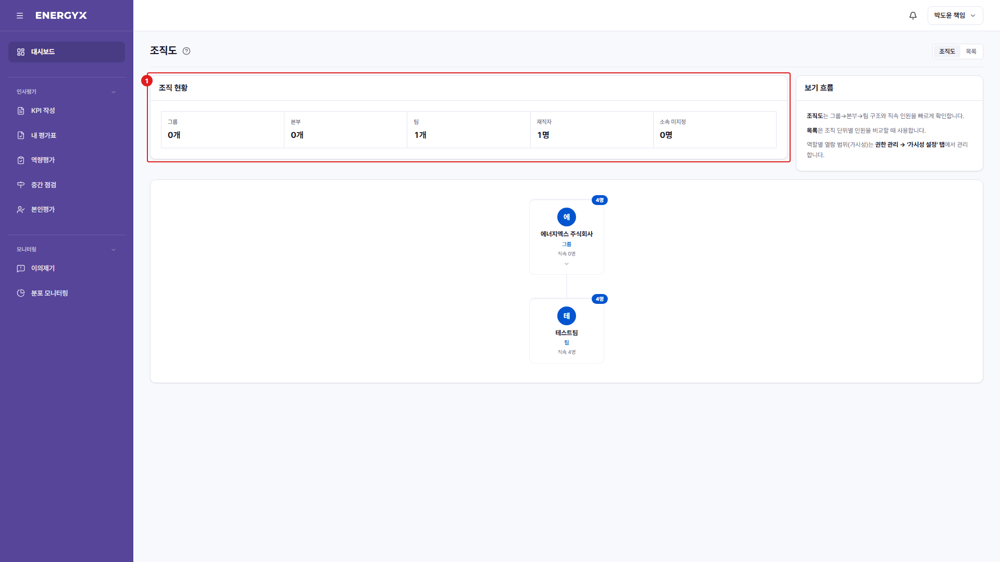

| 번호 | 설명 |
| :---: | --- |
| 1 | **조직 현황** : 그룹·본부·팀 수와 재직 인원 요약입니다. |
