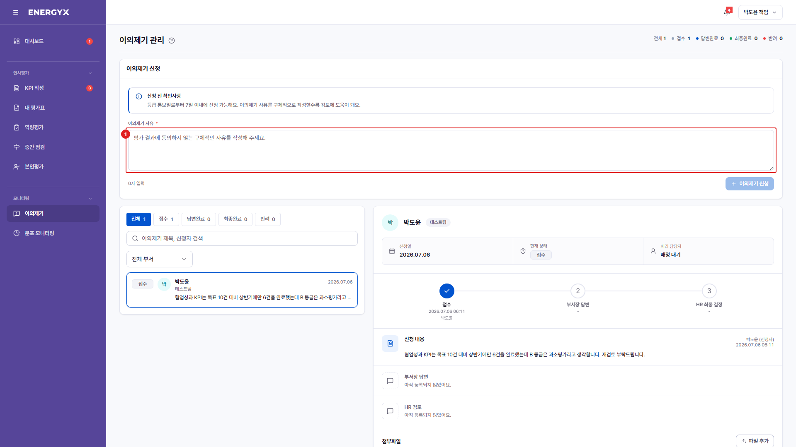

# 이의제기 신청

**메뉴 경로** · 인사평가 > 평가결과 상세 > 이의제기  
**주소** · `/eval/result`

확정된 평가 결과에 이의가 있으면 신청합니다. **[이의제기] 메뉴에는 신청 버튼이 없습니다** — 내 평가결과 상세 화면에서 [이의제기]를 눌러야 신청 폼이 열립니다. 등급 통보 후 7일 이내에 접수해야 합니다.

| 번호 | 설명 |
| :---: | --- |
| 1 | **이의 사유** : 어떤 점이 조정되어야 하는지 구체적으로 적습니다. 근거 파일을 함께 첨부할 수 있습니다. |
