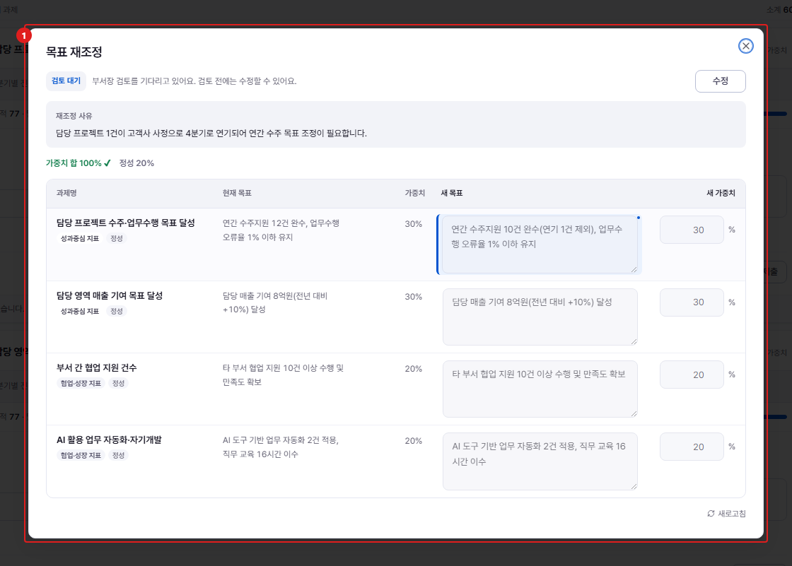

# 중간 점검 — 목표 재조정 신청

**메뉴 경로** · 인사평가 > 중간 점검 > 목표 재조정  
**주소** · `/eval/midterm`

사업 환경이 바뀌어 처음 세운 목표가 맞지 않으면 재조정을 신청합니다. 현재 목표·가중치와 바꾸려는 값을 함께 적어 보내면 상급자가 검토해 승인하거나 반려합니다.

| 번호 | 설명 |
| :---: | --- |
| 1 | **재조정 신청** : 변경할 목표·가중치와 사유를 적습니다. 승인되면 이후 평가는 새 목표를 기준으로 진행됩니다. |
