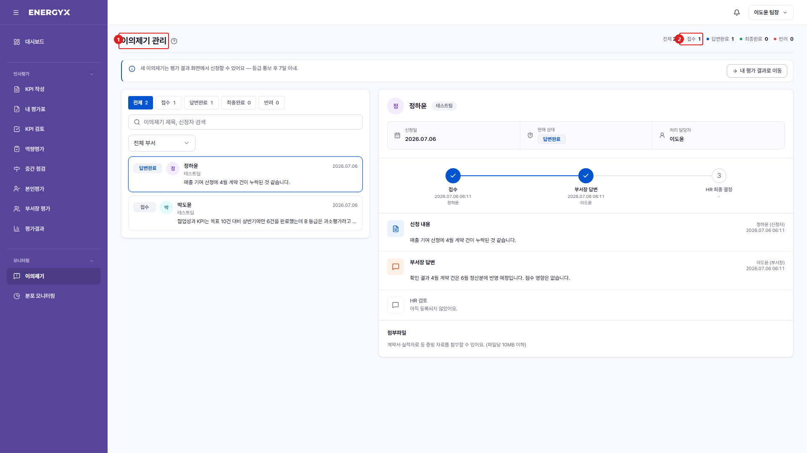

# 이의제기

**메뉴 경로** · 모니터링 > 이의제기  
**주소** · `/appeals`

확정된 평가 결과에 이의가 있으면 신청하고 처리 경과를 확인합니다.

| 번호 | 설명 |
| :---: | --- |
| 1 | **이의제기** : 확정된 결과에 대한 이의를 신청하고 진행 상태를 확인합니다. |
| 2 | **상태** : 접수 → 답변완료 → 최종완료 순으로 진행됩니다. |
