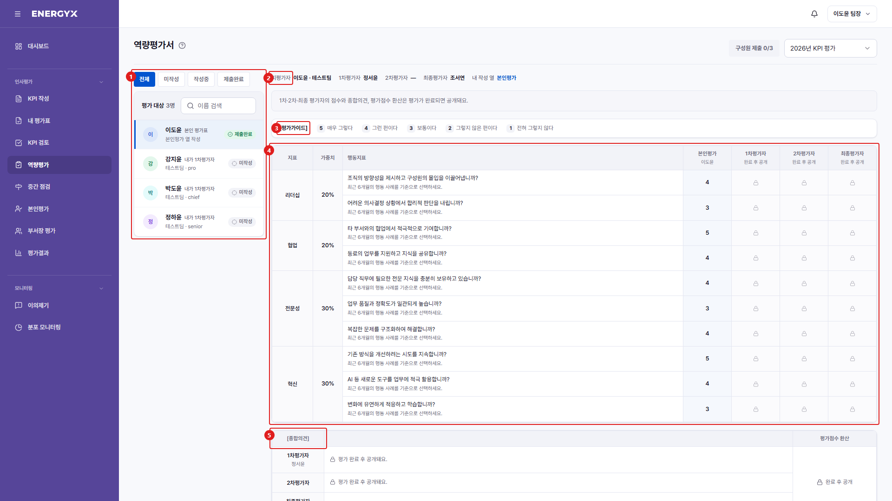

# 역량평가

**메뉴 경로** · 인사평가 > 역량평가  
**주소** · `/competency/eval`

본인과 팀원의 역량을 5점 척도로 평가합니다. 엑셀 역량평가서와 같은 표 형식으로 본인·1차·2차·최종 평가자 열이 나란히 표시됩니다. 역량평가 결과는 참고용으로, 연봉·최종등급에는 반영되지 않습니다. 조정/검토 단계부터 열립니다.

| 번호 | 설명 |
| :---: | --- |
| 1 | **평가 대상** : 본인 평가표와 평가할 팀원 목록입니다. 미작성·작성중·제출완료로 필터할 수 있습니다. |
| 2 | **평가선** : 피평가자와 1차·2차·최종 평가자, 내가 입력하는 열을 표시합니다. |
| 3 | **평가가이드** : 5점(매우 그렇다) ~ 1점(전혀 그렇지 않다) 척도 기준입니다. |
| 4 | **평가표** : 지표·가중치·행동지표와 평가자별 점수 열입니다. 본인 차례의 열만 입력할 수 있습니다. |
| 5 | **종합의견 · 평가점수 환산** : 단계별 종합의견을 남기고, 평가자 점수가 1차 50% · 2차 30% · 최종 20%로 환산됩니다. 본인평가 점수는 환산에 반영되지 않습니다. |
