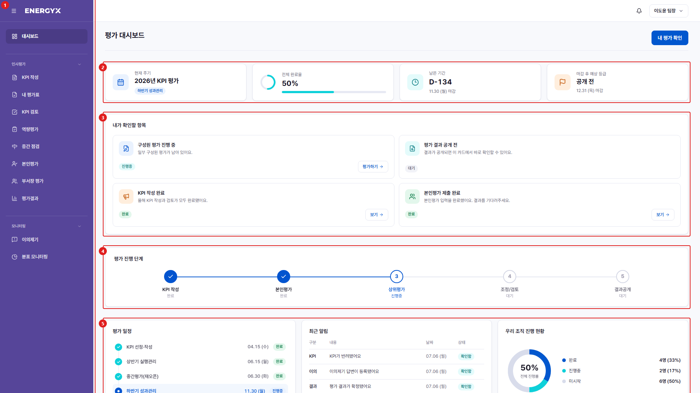

# 대시보드

**메뉴 경로** · 대시보드  
**주소** · `/dashboard`

로그인 후 처음 만나는 화면입니다. 지금 처리해야 할 일, 평가 진행 상황, 최근 알림을 한눈에 확인합니다.

| 번호 | 설명 |
| :---: | --- |
| 1 | **전체 메뉴** : 인사평가·모니터링 등으로 묶인 메뉴입니다. 좌측 상단 아이콘으로 접을 수 있습니다. |
| 2 | **요약 타일** : 현재 평가 주기, 전체 완료율, 마감까지 남은 기간, 결과 공개 예정일입니다. |
| 3 | **내가 확인할 항목** : 지금 처리해야 할 일이 카드로 표시됩니다. 버튼을 누르면 해당 화면으로 바로 이동합니다. |
| 4 | **평가 진행 단계** : KPI 작성 → 본인평가 → 상위평가 → 조정/검토 → 결과공개 중 현재 위치입니다. |
| 5 | **평가 일정 · 최근 알림 · 조직 진행 현황** : 단계별 마감일과 최근 알림, 소속 조직의 진행률입니다. |
