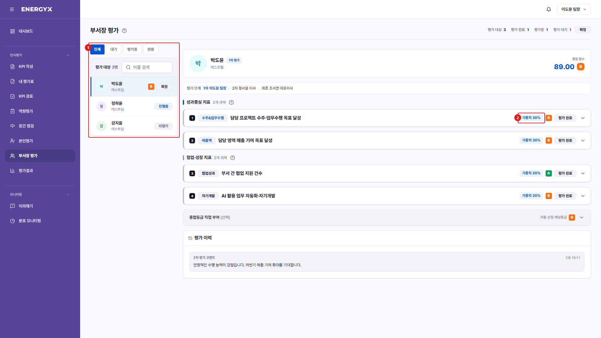

# 부서장 평가

**메뉴 경로** · 인사평가 > 부서장 평가  
**주소** · `/eval/dept-head`

배정된 팀원을 평가합니다. 1차·2차·최종 평가자의 점수가 50%·30%·20% 가중으로 결합됩니다.

| 번호 | 설명 |
| :---: | --- |
| 1 | **대상 목록** : 내가 평가할 팀원입니다. 상태로 필터할 수 있고, 제출하면 다음 대상으로 자동 이동합니다. |
| 2 | **과제별 평가** : 팀원이 제출한 실적을 보고 과제별 등급을 입력합니다. |
