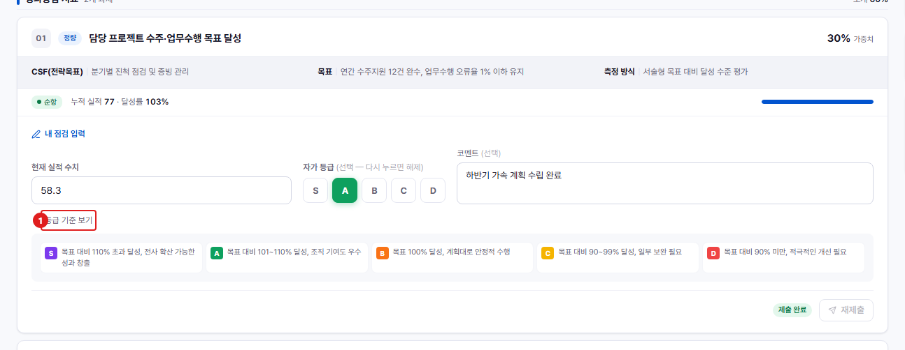

# 중간 점검 — 등급 기준 펼치기

**메뉴 경로** · 인사평가 > 중간 점검 > 등급 기준  
**주소** · `/eval/midterm`

과제마다 [등급 기준 보기]를 누르면 그 과제의 S~D 판정 기준이 카드 안에서 펼쳐집니다. 자가점검 등급을 고르기 전에 무엇이 어느 등급인지 확인하는 데 씁니다.

| 번호 | 설명 |
| :---: | --- |
| 1 | **등급 기준 보기** : 누르면 아래에 S~D 기준이 펼쳐지고, 다시 누르면 접힙니다. |
