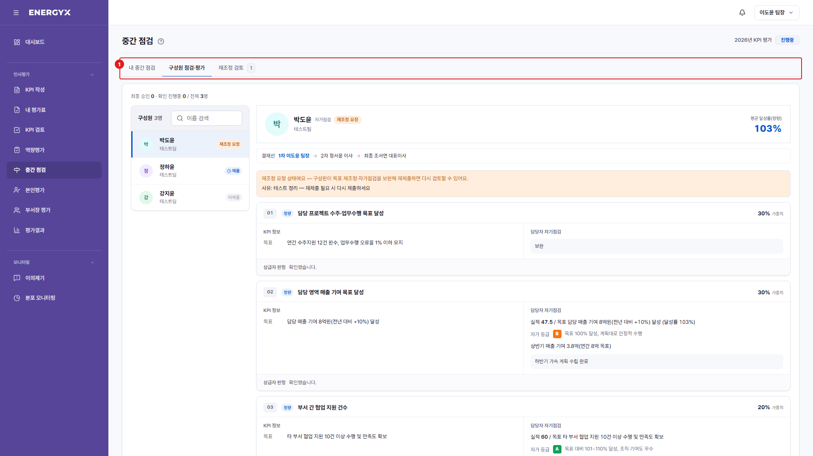

# 중간 점검 — 구성원 점검·평가

**메뉴 경로** · 인사평가 > 중간 점검 > 구성원 점검·평가  
**주소** · `/eval/midterm`

팀원이 제출한 자가점검을 확인하고 의견을 남기거나 반송합니다. 확인은 결재선 순서대로 진행됩니다.

| 번호 | 설명 |
| :---: | --- |
| 1 | **탭 전환** : [구성원 점검·평가] 탭입니다. 숫자 배지는 처리 대기 건수입니다. |
