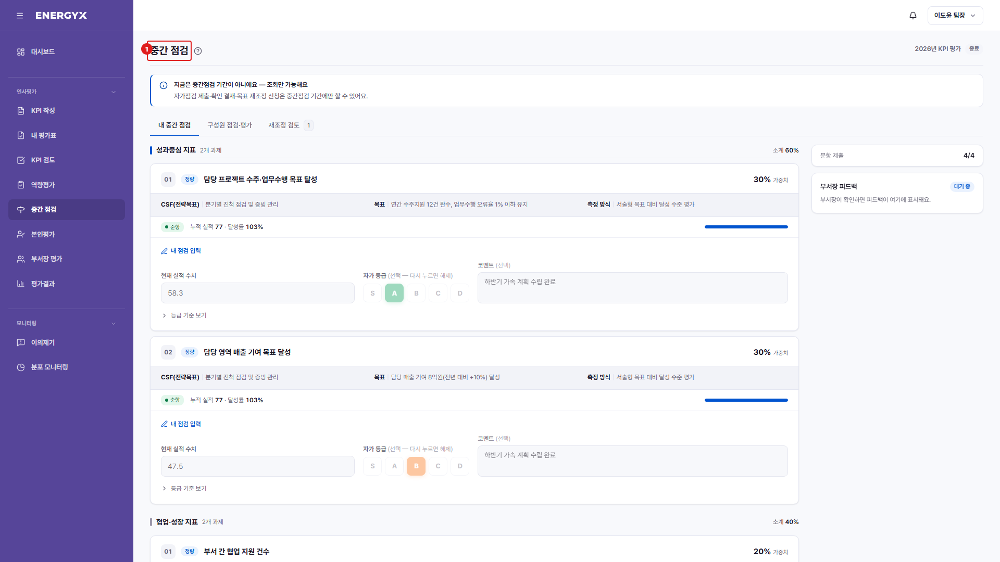

# 중간 점검 — 내 중간 점검

**메뉴 경로** · 인사평가 > 중간 점검  
**주소** · `/eval/midterm`

연중 목표 진척을 스스로 점검해 제출합니다. 등급·보상에는 반영되지 않는 참고 절차입니다.

| 번호 | 설명 |
| :---: | --- |
| 1 | **중간 점검** : 연중 목표 진척을 스스로 점검해 제출하는 화면입니다. |
| 2 | **총평** : 상반기 진행 상황을 서술로 남깁니다. [총평 저장]으로 임시 저장됩니다. |
