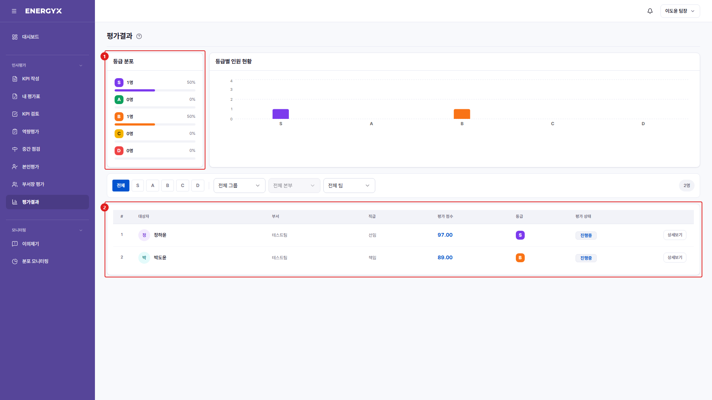

# 평가결과

**메뉴 경로** · 인사평가 > 평가결과  
**주소** · `/eval/result`

팀원의 평가 결과를 확인합니다. 행을 클릭하면 개인별 상세 평가표로 이동합니다.

| 번호 | 설명 |
| :---: | --- |
| 1 | **등급 분포** : 조회 범위의 S~D 인원과 비율입니다. |
| 2 | **결과 목록** : 대상자별 최종점수·등급·평가 상태입니다. |
