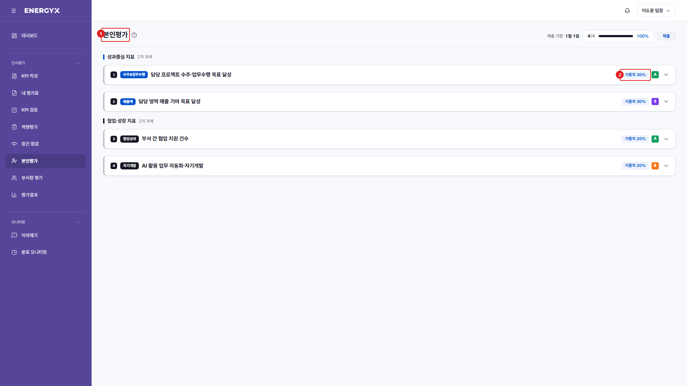

# 본인평가

**메뉴 경로** · 인사평가 > 본인평가  
**주소** · `/eval/self`

확정된 KPI에 대해 본인의 실적과 등급을 입력해 제출합니다. 평가 기간(최종평가 일정) 안에서만 작성할 수 있습니다.

| 번호 | 설명 |
| :---: | --- |
| 1 | **본인평가** : 확정된 KPI에 대해 실적과 등급을 입력합니다. |
| 2 | **과제별 카드** : 확정된 KPI가 순서대로 표시되고, 각 카드에서 실적과 등급(S~D)을 선택합니다. |
