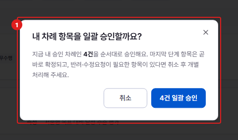

# KPI 검토 — 일괄 승인

**메뉴 경로** · 인사평가 > KPI 검토 > 일괄 승인  
**주소** · `/kpi/review`

내 차례인 과제를 한 번에 승인합니다. 승인 전 확인 창에서 대상 건수를 확인할 수 있습니다.

| 번호 | 설명 |
| :---: | --- |
| 1 | **일괄 승인 확인** : 몇 건이 승인되는지 확인하고 진행합니다. 마지막 결재자면 승인과 동시에 KPI가 확정됩니다. |
