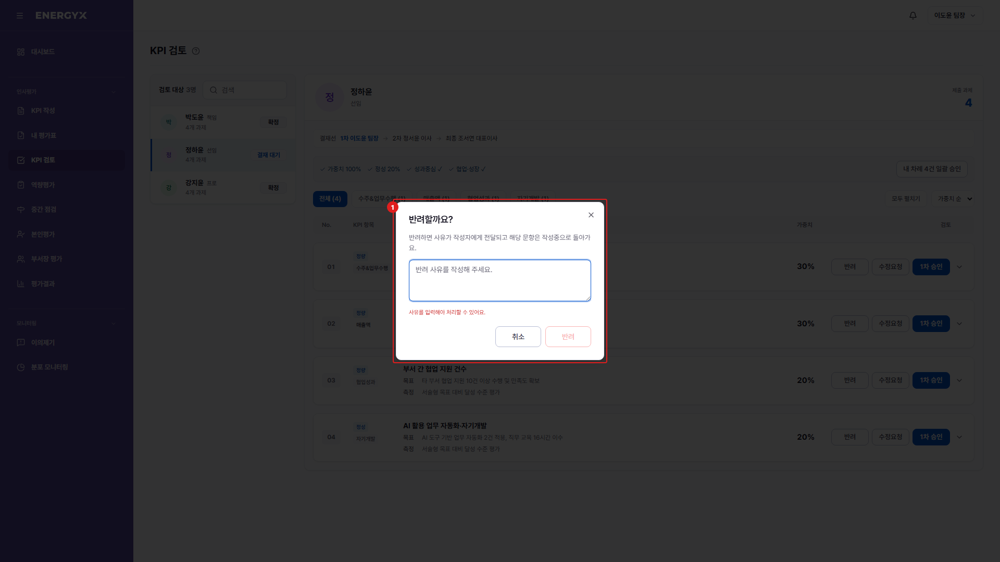

# KPI 검토 — 반려하기

**메뉴 경로** · 인사평가 > KPI 검토 > 반려  
**주소** · `/kpi/review`

보완이 필요하면 반려합니다. 사유를 적어 보내면 작성자에게 알림이 가고 KPI가 작성중 상태로 돌아갑니다. 반려는 결재선에 속한 사람이면 하위 단계가 승인한 뒤에도 할 수 있습니다.

| 번호 | 설명 |
| :---: | --- |
| 1 | **반려 사유** : 무엇을 보완해야 하는지 적어 보냅니다. 작성자에게 알림으로 전달됩니다. |
