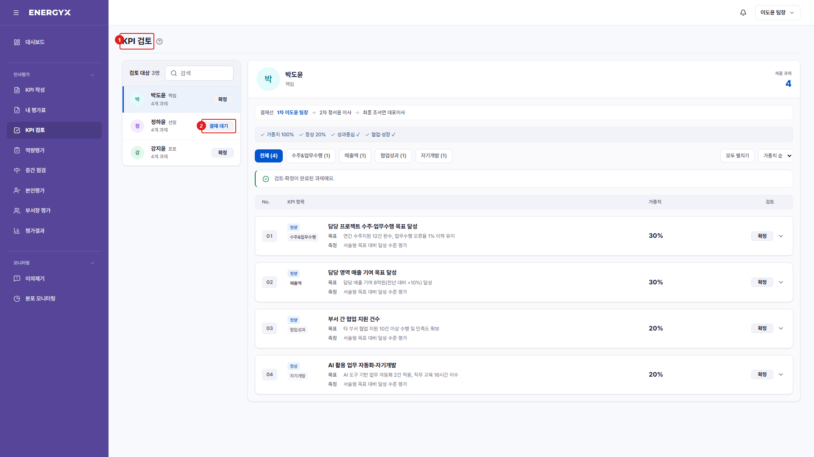

# KPI 검토

**메뉴 경로** · 인사평가 > KPI 검토  
**주소** · `/kpi/review`

팀원이 제출한 KPI를 결재선(1차 팀장 → 2차 본부장 → 최종 그룹대표) 순서대로 승인하거나 반려합니다.

| 번호 | 설명 |
| :---: | --- |
| 1 | **KPI 검토** : 팀원이 제출한 KPI를 결재선 순서대로 처리합니다. |
| 2 | **결재 상태** : 작성중 / 결재 대기 / 확정으로 구분됩니다. 승인 버튼은 본인 차례일 때만 나타납니다. |
