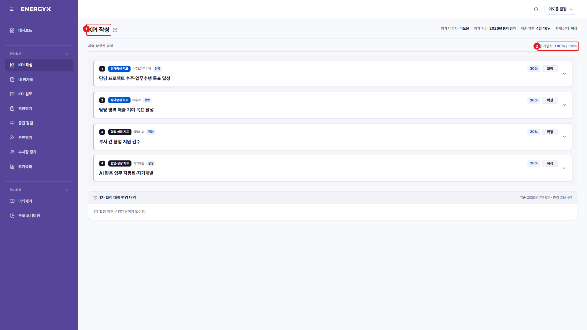

# KPI 작성

**메뉴 경로** · 인사평가 > KPI 작성  
**주소** · `/kpi`

연초에 본인의 KPI(성과 목표)를 작성해 상급자에게 제출합니다. 가중치 합계가 100%가 되어야 제출할 수 있습니다.

| 번호 | 설명 |
| :---: | --- |
| 1 | **KPI 작성** : 올해 본인의 성과 목표를 등록하는 화면입니다. |
| 2 | **가중치** : 과제별 비중입니다. 전체 합계가 100%가 되어야 제출할 수 있습니다. |
