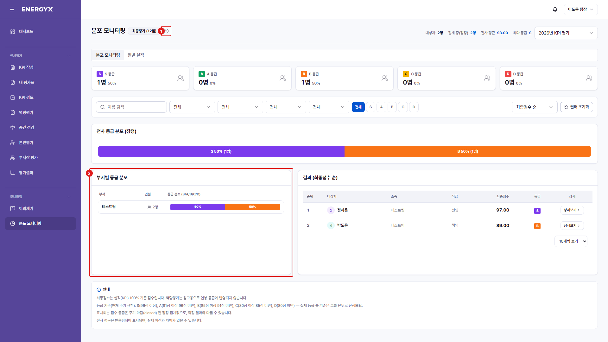

# 분포 모니터링

**메뉴 경로** · 모니터링 > 분포 모니터링  
**주소** · `/reports`

조직별 등급 분포를 모니터링합니다.

| 번호 | 설명 |
| :---: | --- |
| 1 | **탭 전환** : 분포 모니터링과 월별 실적을 전환합니다. |
| 2 | **부서별 등급 분포** : 부서별 인원과 S/A/B/C/D 비중입니다. |
